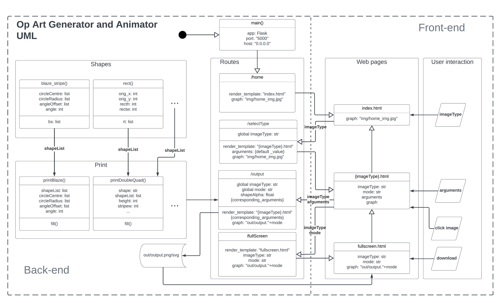

# Op Art Generator and Animator

## Objective
*This project aims to use computer technology to generate images similar to those produced by Bridget Riley, but allow the computer user to adjust the parameters used to generate the images.*

## Abstract
Optical Art, also known as Op Art, is a genre of visual art specifically uses optical illusions to create bizarre artistic effects. Usually op arts are made by artists using periodic arrangement of lines, shapes, colours, etc. By applying optical effect to a flat picture, it can trick viewers' eyes into thinking it is three-dimensional.

Op Art became extremely famous and popular in the 1960s. People used them as design for their clothes, CD covers, houses and so on. Op Art had even been adapted as a television commercial back then.

Regardless of op art being well-known centuries ago, it is still a magnificent form of art bringing vibrant effect and strong emotion to viewers. With the development of computing technology, digital art has become common to public, more and more people are willing to create their artwork using a computer rather by hand.

Despite of existing software that works in artistic aspects, lack of simplicity and professional focus makes Op Art artists difficult to plan and design their artwork based on computer. Therefore, there has been a high demand on designing such program that could aim better on Op Art and give better inspirations to those who work in this aspect.

This README file introduces the development and evolution of an Op Art Generator program which help attracting the interest in Op Art from people and giving better understanding in Op Art for professional artists.

## Usage
The program aims on helping users in following scenarios:
- For users who would like to get a basic knowledge of what op art is and play around with the generated image.
- For art learners and students to study with op art, especially artworks from Bridget Riley. 
- Generate and adjust shapes and patterns of the artwork for professional artists who want to get inspirations and ideas when create their own optical illusion form of artworks.
- Save the op art image to make further use and process.

## Advantages
Compare to traditional hand-drawing form of op art creation, the op art generator program has following advantages:
- It generates artworks in almost no time and is way faster.
- Users can treat the program as a draft creator and plan for their artwork in advance.
- Its artwork can be saved and stored in local files in digital form, convenient to transfer or share.

## Program Structure
### Update
Due to free plan ends from 28 Nov 2022 on Heroku platform, the web app is moved to Fly.io from now on.

The program is in a form of web app and can be accessed via the link:
https://opartgenerator.fly.dev/

The program structure is basically:
- Python with Flask framework as back-end;
- HTML, JavaScript and CSS as GUI;
- deployed onto Fly.io cloud platform as web app.

Below is the whole program UML chart:

## Acknowledgement
I would like to express my deepest appreciation to my supervisor Dr. Peter McBrien for providing me valuable opinions and guidance related to the artistic aspect throughout the duration of this project.

I would also like to thank my second marker Dr. Nicolas Wu who also provided me useful suggestions for the researching direction.

I am also grateful to my friends in college, who patiently experienced my program in the early stage and advised me brilliant ideas on how to improve it.

Last but not least, I would also like to appreciate my family for the emotional support they gave me while working on this project.

## Contributor
Author: Shitian Jin (GitHub username: [mihane-ichinose](https://github.com/mihane-ichinose))

Supervisor: [Peter McBrien](https://www.imperial.ac.uk/people/p.mcbrien)

Second Marker: [Nicolas Wu](https://www.imperial.ac.uk/people/n.wu)